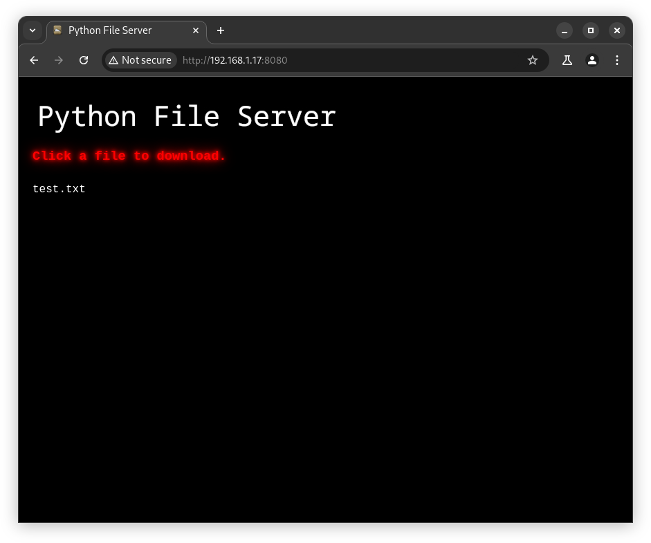

## Overview

`pfserver` is a Python-based web file server built on the `http.server` module. It allows users to share and access files over a local network. With features like dynamic file listings, file exclusion, and process management, `pfserver` is an excellent tool for quickly setting up a simple file-sharing service.



## Features

1. **Customizable Document Root**:
   - Serve files from any directory by specifying the document root (`DOC_ROOT`).

2. **File Exclusion**:
   - Automatically exclude specified files from the directory listing (e.g., `index.html`, `style.css`, `server.pid`). These files remain accessible if their exact URLs are known.

3. **Dynamic File Listings**:
   - Automatically generate a user-friendly HTML page displaying available files for download.

4. **Process Management**:
   - A `server.pid` file is created to track the server process, enabling easy start/stop operations.

5. **Daemon Mode**:
   - The server can run in the background as a daemon, ensuring seamless operation.

6. **Integrated Logging**:
   - Logs server activity in a `server.log` file for monitoring and troubleshooting.

## Installation

### Requirements
- Python 3

### Setup
1. Clone or download the repository.
```
git clone https://github.com/t0xh3x/pfserver.git
```

3. Place files in the desired directory.
4. Make `pfserver.py` executable: `chmod +x pfserver.py`. 

## Configuration

Customize the following variables in the `pfserver.py` script to suit your needs:

- **Document Root**:
  ```
  DOC_ROOT = /path/to/pfserver/pfserver_files/
  ```
  Set the directory from which files will be served.

- **Port Number**:
  ```
  PORT_NUMBER = 8080
  ```
  Change the port number if the default (`8080`) is in use.

- **Excluded Files**:
  ```
  EXCLUDED_FILES = ['index.html', 'style.css', 'favicon.ico']
  ```
  Add or remove file names to exclude them from the directory listing.

- **Header text, header image**:  
  ```
  '',
  ```
  ```
  '<h1>Python File Server</h1>',
  ```
  To use either a header image or text, comment out or remove the other.
  The header image file is located in `pfserver_files/`.
  
## Usage

### Start the Server
Run the following command to start the server:
```bash
./pfserver.py -u
```
- The server will start in the background and serve files at `http://localhost:8080` by default.
- Download files by clicking on their links in the dynamically generated directory listing.
- Server log are stored in `/path/to/pfserver/pfserver_files/server.log`.

### Stop the Server
Use this command to stop the server:
```bash
./pfserver.py -d
```

### Check Server Status
Verify if the server is running using:
```bash
ps aux | grep python
```

### Force Kill the Server
If the server does not stop gracefully:
1. Locate the server’s PID using:
   ```bash
   cat /path/to/pfserver/pfserver_files/server.pid
   ```

2. Terminate the process:
   ```bash
   kill -9 <PID>
   ```

## Troubleshooting

- **Server Fails to Start**:
  - Ensure the document root directory exists and is accessible.
  - Check the log in `server.log` for detailed error messages.

- **Permission Issues**:
  - Ensure you have proper permissions for the document root and log files.

- **Port in Use**:
  - If port `8080` is already in use, change the `PORT_NUMBER` in the script and restart.

## Disclaimer

This script is intended for personal use on trusted networks. Do not use it on public or insecure networks without implementing additional security measures.

