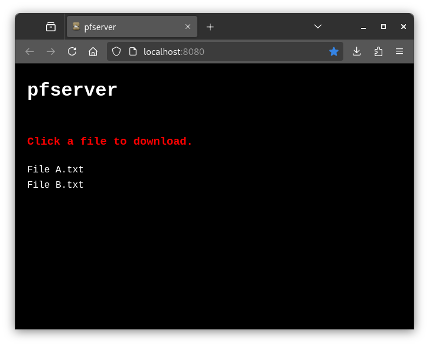

## Overview

`pfserver` is a Python-based web file server built on the `http.server` module. It allows users to share and access files over a local network. With features like dynamic file listings, file exclusion, and process management, `pfserver` is an excellent tool for quickly setting up a simple file-sharing service.



## Features

1. **JSON Configuration**:
   - Server settings are managed through a JSON configuration file for easy modification.
   - Configure document root, port, excluded files, and header settings in one place.

2. **Customizable Document Root**:
   - Serve files from any directory by specifying the document root in the configuration.

3. **File Exclusion**:
   - Automatically exclude specified files from the directory listing (e.g., `index.html`, `style.css`, `server.pid`).
   - Configure excluded files list in the JSON configuration.

4. **Dynamic File Listings**:
   - Automatically generate a the HTML page displaying available files for download.

5. **Process Management**:
   - A `server.pid` file is created to track the server process, enabling easy start/stop operations.

6. **Daemon Mode**:
   - The server can run in the background as a daemon, ensuring seamless operation.

7. **Integrated Logging**:
   - Logs server activity in a `server.log` file for monitoring and troubleshooting.

## Installation

### Requirements
- Python 3

### Setup
1. Clone or download the repository.
```
git clone https://github.com/t0xh3x/pfserver.git
```


2. Place files in the desired directory.
3. Make `pfserver.py` executable: `chmod +x pfserver.py`.

## Configuration

The server is configured through `server_config.json` in the same directory as `pfserver.py`. Here's an example configuration:

```json
{
    "doc_root": "/path/to/pfserver/pfserver_files/",
    "port": 8080,
    "excluded_files": ["index.html", "style.css", "favicon.ico"],
    "header_image": true,
    "header_text": "pfserver",
    "header_image_file": "header.jpg"
}
```

### Configuration Options:

- **doc_root**: Directory from which files will be served
- **port**: Port number for the server (default: 8080)
- **excluded_files**: List of files to hide from directory listing
- **header_image**: Boolean to toggle between image or text header
- **header_text**: Text to display when header_image is false
- **header_image_file**: Image file name for header (file must be in doc_root)

## Usage

### Start the Server
Run the following command to start the server:
```bash
./pfserver.py -u
```
- The server will start in the background and serve files at `http://localhost:8080` by default (or the configured port).
- Download files by clicking on their links in the dynamically generated directory listing.
- Server logs are stored in `server.log` within your configured document root.

### Stop the Server
Use this command to stop the server:
```bash
./pfserver.py -d
```

### Check Server Status
Verify if the server is running using:
```bash
ps aux | grep python
```

### Force Kill the Server
If the server does not stop gracefully:
1. Locate the server's PID using:
   ```bash
   cat /path/to/server.pid
   ```
   (The PID file will be in your configured document root)

2. Terminate the process:
   ```bash
   kill -9 <PID>
   ```

## Troubleshooting

  - Check file permissions and path validity.
  - Ensure `server_config.json` exists and is properly JSON formated.
  - Verify the configuration file is properly formatted.
  - Check the log in `server.log` for error messages.
  - If the configured port is already in use, modify the port number in `server_config.json` and restart.

## Common Errors

  ```
  Fork not available, running in background...
  Failed to start server. Check logs for details.
  ```
  - When starting the `pfserver.py` script if the above error occurs the `server_config.json` file is not set correctly.

## Disclaimer

This script is intended for personal use on trusted networks. Do not use it on public or insecure networks without implementing additional security measures.
